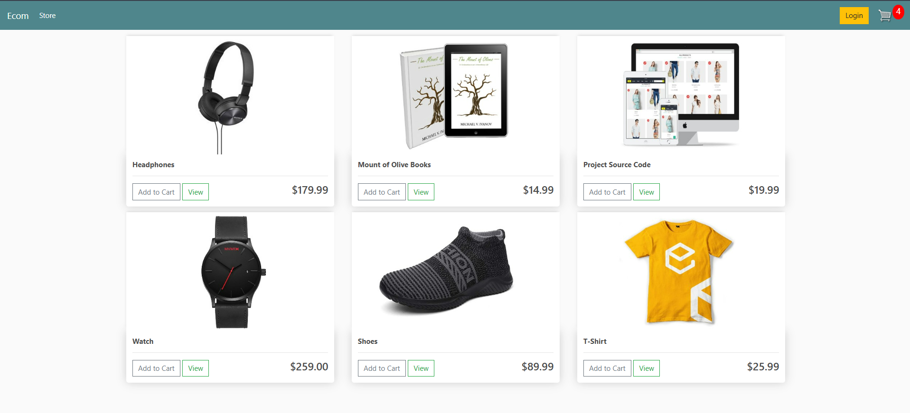
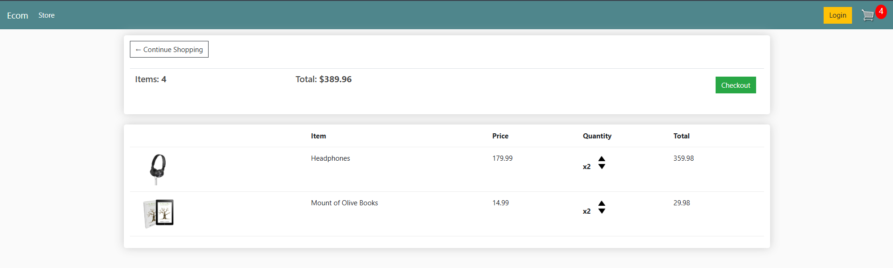
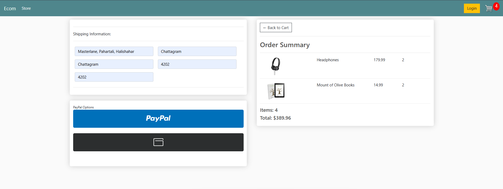

# Ecommerce 
An **Ecommerce Website** built using Django, providing a seamless shopping experience for logged-in users and guest users. This project showcases a fully functional store with cart management, a checkout system, and PayPal payment integration.

## Features

1. **Store Page**:
   - Displays products with images and pricing.
   - Allows adding products to the cart.

2. **Cart Page**:
   - Displays added products with quantities.
   - Allows updating quantities or removing products.
   - Shows the total amount.

3. **Checkout Page**:
   - Form for shipping address.
   - For guest users, includes additional fields for name and email.
   - PayPal payment integration.

4. **User Authentication**:
   - Registered users can log in using email.
   - Sessions are used for logged-in users.
   - Guest users use cookie-based sessions for cart management.

5. **Responsive Design**:
   - Optimized for both desktop and mobile devices.

## Screenshots

- **Store Page**:
  

- **Cart Page**:
  

- **Checkout Page**:
  

## Installation

1. **Clone the repository**:
   ```bash
   git clone <repository-url>
   cd <repository-directory>

2. **Install dependencies**:

    ```bash
    pip install -r requirements.txt
    ```

3. **Run migrations**:

    ```bash
    python manage.py migrate
    ```

4. **Start the development server**:

    ```bash
    python manage.py runserver
    ```
## Usage

1. **Logged-In Users**:
   - Register or log in using the authentication system.
   - Add products to the cart, manage quantities, and proceed to checkout.
   - Session-based storage for cart items.

2. **Guest Users**:
   - Add products to the cart without logging in.
   - Cookies are used to manage cart items.
   - Enter name, email, and shipping details at checkout.

3. **Payment**:
   - Complete payment using PayPal integration.

## Tech Stack

- **Backend**: Django
- **Frontend**: HTML, CSS, JavaScript
- **Database**: SQLite (default)
- **Payment Gateway**: PayPal

## Future Improvements

1. Adding **unit tests** for cart and checkout functionalities.
2. Introducing **order tracking** for logged-in users.
3. Expanding payment options beyond PayPal.
4. Enhancing product filters and sorting features.
5. Improving scalability for production environments.
